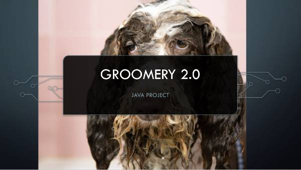
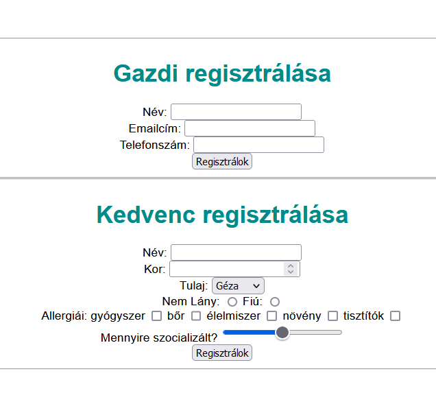
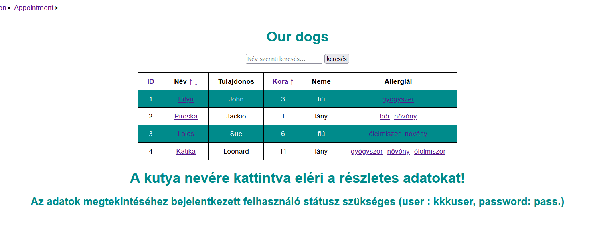
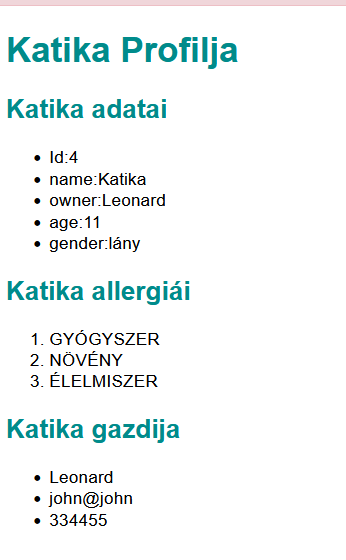
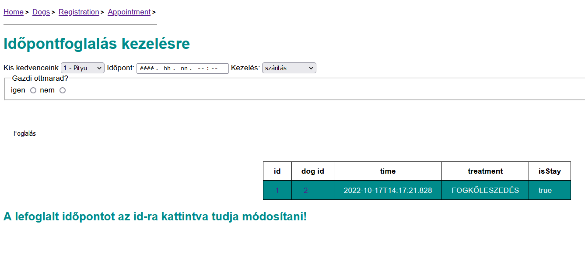

 <div align="center">
  <a href="https://github.com/github_username/repo_name">
    
  </a>
<h3 align="center">Cats & dogs groomery - Java project</h3>
  <p align="center">
    A small Java app for groomeries.
    <br />
   <a href="https://cats-and-dogs.azurewebsites.net/">View Demo</a>
    
  </p>
</div>


<!-- TABLE OF CONTENTS -->
<details>
  <summary>Table of Contents</summary>
  <ol>
    <li>
      <a href="#about-the-project">About The Project</a>
      <ul>
        <li><a href="#built-with">Built With</a></li>
      </ul>
    </li>
   <li>
      <a href="#getting-started">Getting Started</a>
      <ul>
        <li><a href="#installation">Installation</a></li>
      </ul>
    </li>
    <li><a href="#usage">Usage</a></li>
    <li><a href="#near-future">Near future</a></li>
    <li><a href="#contact">Contact</a></li>
  </ol>
</details>


<!-- ABOUT THE PROJECT -->
## About The Project
<div align="center">

</div>
In this application You can register owner and pets, can book an appointment for different treatments. You can modify your appointment, and for those, who is a "User", can see the detailed datas of the pet.


### Built With

* Java
* Spring Boot
* Thymeleaf

<!-- GETTING STARTED -->
## Getting Started


### Installation
 
1. Clone the repo
   ```sh
   git clone https://github.com/Webby-lab/cats_and_dogs-withMaven
   ```
2. Open in IntelliJ IDEA - new maven project
3. Run on localhost, or deploy on Azure like  <a href="https://cats-and-dogs.azurewebsites.net/">this project</a>


<!-- USAGE EXAMPLES -->
## Usage
- [ ] Register owner, or pet
- [ ] See the registered pets database
- [ ] Book an appointment for different treatments
    - [ ] modify a booked appointment
- [ ] See the datas of a pet, and its owner

<p align="center">





## Near future
- [ ] new security features, admin role
- [ ] add groomers
- [ ] make the app more fancy

<!-- CONTACT -->
## Contact

Krisztina Kövér  - info@webby.hu

Project Link: [https://cats-and-dogs.azurewebsites.net](https://cats-and-dogs.azurewebsites.net)


